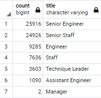

# Pewlett-Hackard-Analysis
## Overview of the Analysis

### Purpose
The purpose of this analysis is to prepare the upcoming "silver tsunami" as many current employees are reaching the retirement age.
There are **2 key deliverables** :
 - To determine the number of retiring employees per title
 - To identify employees who are eligible to participate in a mentorship program

## Results
- There are roughly 72,000 employees retiring (born in 1952-1955)
- Below is the number of retiring employees per title

- Out of the 72,000 employees, title of "Senior Engineer" and "Senior Staff" represents over 70% of the retiring employees
- There are roughly 1,550 employees eligible for the mentorship program (born in 1965)

## Summary
1. How many roles will need to be filled as the "silver tsunami" begins to make an impact?
Based on the number of retiring employees per titles image shown above, we can anticiapte the number of roles potentially need to be filled, in which the Senior Enginner and Senior Staff are the most urgent postitions to consider.

2. Are there enough qualified, retirement-ready employees in the departments to mentor the next generation of Pewlett Hackard employees?

There are roughly 1,550 employees that are eligible to participate the mentorship program. However, roughly 72,000 postions need to be filled within the next couple of years, so the number of mentors that are currently considered qualified are not enought to mentor the next generation.
