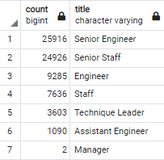
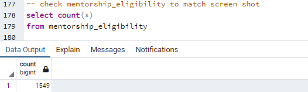
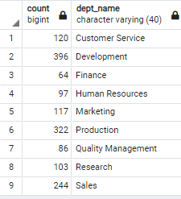
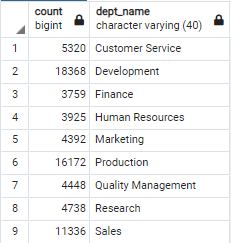

# Pewlett-Hackard-Analysis
## Overview of the Analysis

### Purpose
The purpose of this analysis is to prepare the upcoming "silver tsunami" as many current employees are reaching the retirement age.
There are **2 key deliverables** :
 - To determine the number of retiring employees per title
 - To identify employees who are eligible to participate in a mentorship program

## Results

- There are roughly 72,000 employees retiring
- There are 7 retiring titles : 
  - Senior Engineer 
  - Senior Staff
  - Engineer
  - Staff
  - Technical Leader
  - Assistant Engineer
  - Manager
- Out of the 72,000 employees, title of "Senior Engineer" and "Senior Staff" represents over 70% of the retiring employees
- There are roughly 1,550 employees eligible for the mentorship program 


**Retiring Employees per Title**



**Mentorships Eligibility**



## Summary
- How many roles will need to be filled as the "silver tsunami" begins to make an impact?
  - Based on the number of retiring employees per titles image shown above, we can anticiapte the number of roles potentially need to be filled, in which the Senior Enginner and Senior Staff are the most urgent postitions to consider.

- Are there enough qualified, retirement-ready employees in the departments to mentor the next generation of Pewlett Hackard employees?
  - No there are not enough mentors. There are roughly 1,550 employees that are eligible to participate the mentorship program. However, roughly 72,000 postions need to be filled within the next couple of years, so the number of mentors that are currently considered qualified are not enought to mentor the next generation.

#### Further Analysis
To get more insights on how we can solve this problem, we can further identify the below:
  - **How many people are retiring in each department**
  ```
SELECT count(*), d.dept_name
FROM unique_retirement_title as urt
JOIN dept_emp as de ON urt.emp_no = de.emp_no
JOIN departments as d ON d.dept_no = de.dept_no
where de.to_date = '9999-01-01'
group by d.dept_name
  ```



  - **How many eligible mentors are in each department**
  ```
SELECT COUNT (de.emp_no), d.dept_name
FROM mentorship_eligibility as me
JOIN dept_emp as de ON me.emp_no = de.emp_no
JOIN departments as d ON d.dept_no = de.dept_no
where de.to_date = '9999-01-01'
GROUP BY d.dept_name
  ```

